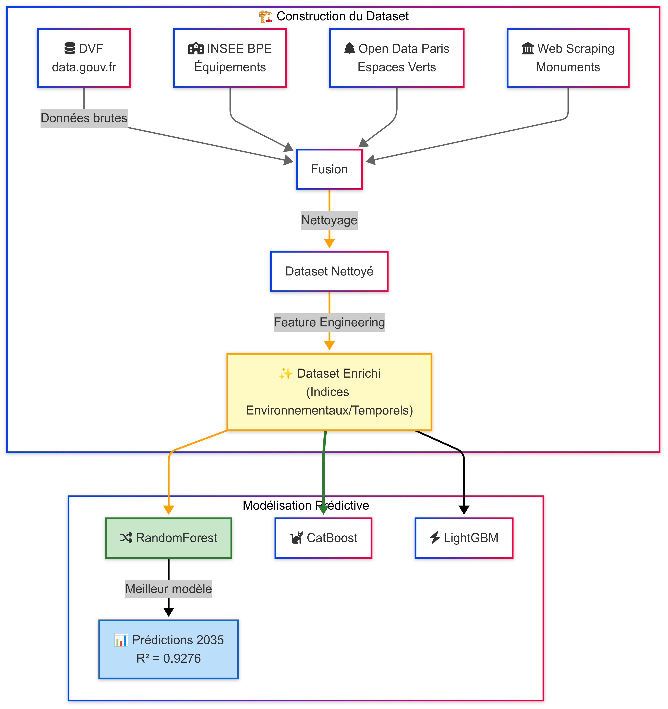
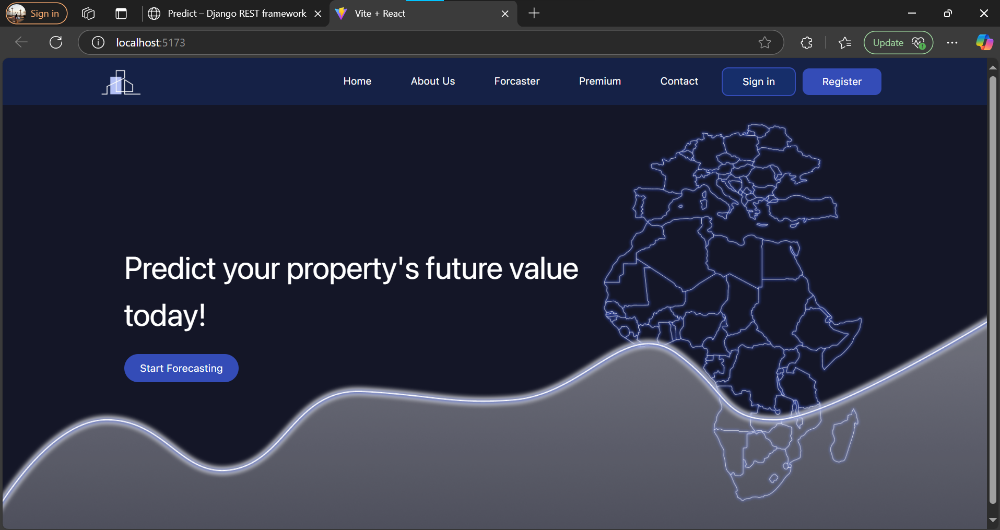
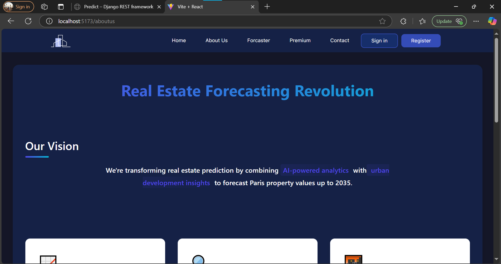
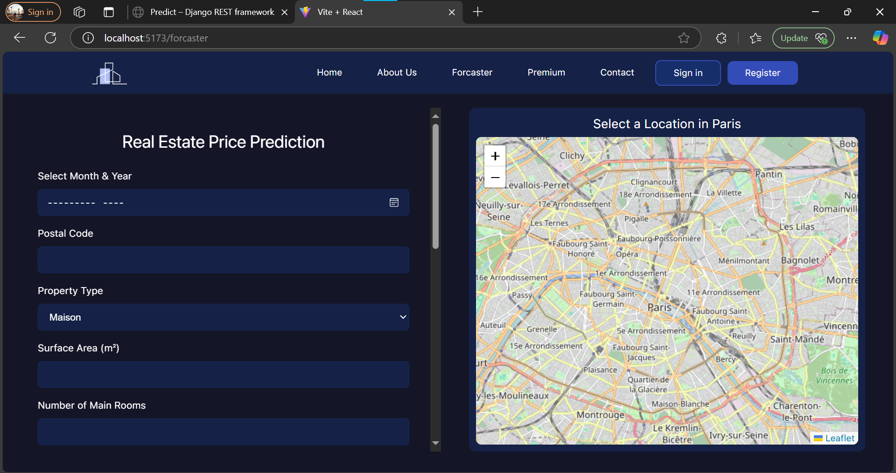
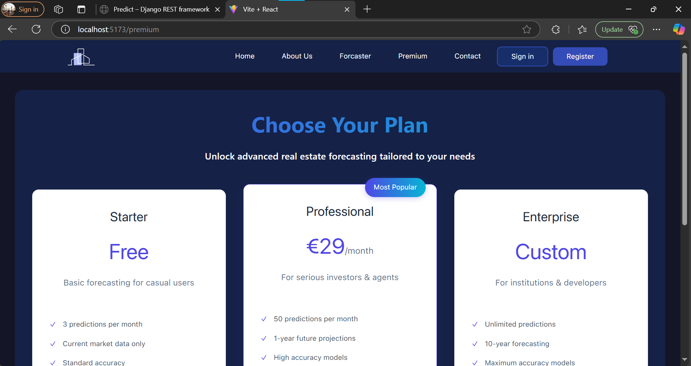
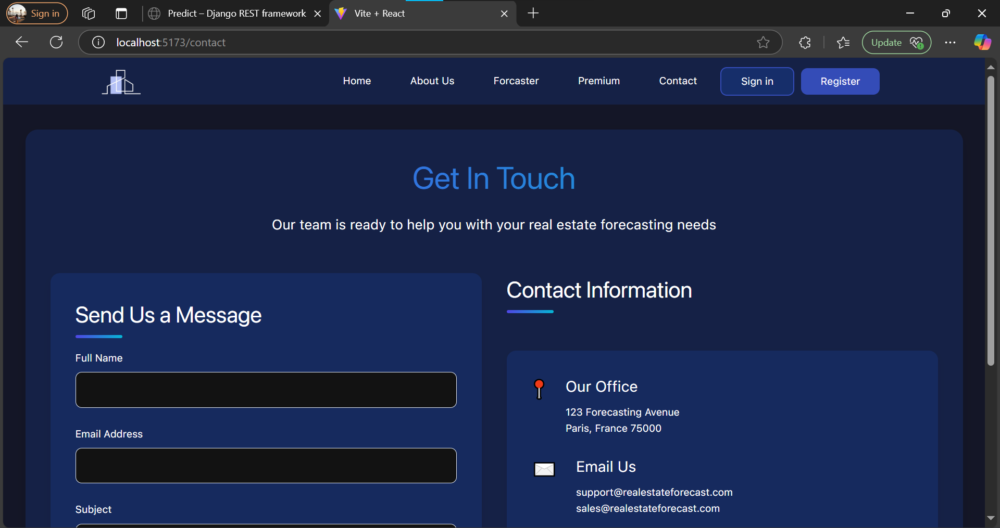
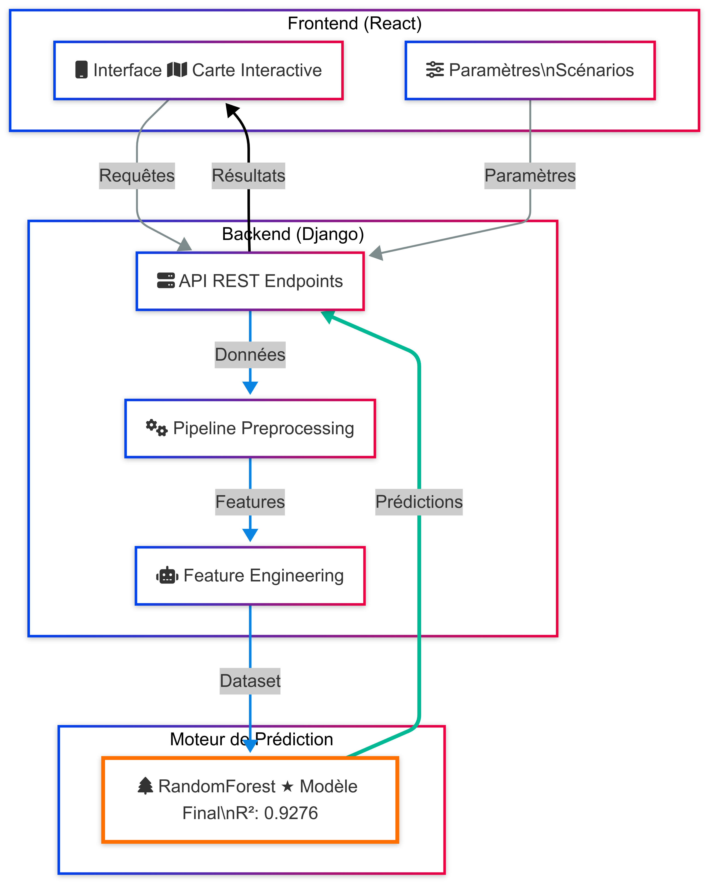

<div align="left"> <a href="./README.md">🇫🇷 Français</a> | <a href="./README.en.md">🇬🇧 English</a> </div>

---
<a name="top"></a>

# 🏙️ Real Estate Price Forecasting – Paris

This project aims to predict real estate prices in Paris using machine learning models, combining open data, geographic indicators, and an interactive map for an enhanced user experience. The application is developed with a **React frontend**, **Django REST API backend**, and **predictive models** trained in Python.

## Additional Resources

Some large files are not deployed on GitHub. The complete project version (including all large files) is available on [Google Drive](https://drive.google.com/drive/folders/1vYITJk4CXEnHrc1Z6ucaT_i9hUV4zPMX?usp=sharing).  
Feel free to access it for all resources.

## Demo Video

A demonstration video is available to illustrate the interpretation of results in the user interface after launching the application.

[Click here to watch the video](https://drive.google.com/file/d/1QE-VTaCejBlfkHpP5z2i3_TJZnjKV8Pk/view?usp=sharing)

## 📑 Table of Contents

1. [Introduction](#1-introduction)  
  1.1 [Project Objectives](#11-project-objectives)  
  1.2 [General Description](#12-general-description)  
  1.3 [Use Case Diagram](#13-use-case-diagram)  
  1.4 [Class Diagram](#14-class-diagram)

2. [Technologies and Tools Used](#2-technologies-and-tools-used)  
  2.1 [Technical Stack](#21-technical-stack)  
  2.2 [Libraries and APIs](#22-libraries-and-apis)  

3. [Dataset Construction](#3-dataset-construction)  
  3.1 [Data Sources](#31-data-sources)  
  3.2 [Web Scraping](#32-web-scraping)  
  3.3 [Merging and Preprocessing](#33-merging-and-preprocessing)  
  3.4 [Feature Engineering](#34-feature-engineering)  

4. [Predictive Modeling](#4-predictive-modeling)  
  4.1 [Model Selection](#41-model-selection)  
  4.2 [Training and Validation](#42-training-and-validation)  
  4.3 [Performance Evaluation](#43-performance-evaluation)  

5. [Backend – Django API](#5-backend-django-api)  
  5.1 [API Architecture](#51-api-architecture)  
  5.2 [Key Endpoints](#52-key-endpoints)  
  5.3 [Frontend Communication](#53-frontend-communication)  

6. [Frontend – React Application](#6-frontend-react-application)  
  6.1 [User Interface](#61-user-interface)  
  6.2 [API Connection](#62-api-connection)  
  6.3 [Responsive Design](#63-responsive-design)  
  6.4 [Screenshots](#64-screenshots)

7. [Interactive Map](#7-interactive-map)  
  7.1 [Purpose](#71-purpose)  
  7.2 [Features](#72-features)  
  7.3 [Technologies Used](#73-technologies-used)

8. [Installation and Configuration](#8-installation-and-configuration)

9. [Conclusion](#9-conclusion)

---

## 1. Introduction

### 1.1 Project Objectives

This project aims to go beyond the classic limitations of real estate prediction models by offering an intelligent and forward-looking solution capable of **anticipating the evolution of real estate prices in Paris over the next 10 years**.  
The objectives are as follows:

- **Predict future prices** of real estate in the short and medium term (up to 2035), integrating not only current data but also **upcoming development projects**, **public policies**, and **planned urban investments**.
- Lever **open data** and **information extracted from government sites** (PLU, construction projects, urban renovations, etc.) using **web scraping** techniques to enrich the knowledge base.
- Consider **future influencing factors** (new transport lines, school construction, commercial areas, parks, etc.) to model territorial dynamics with potential impact on property values.
- Provide a predictive and interactive decision-making tool for investors, urban planners, citizens, and public actors.

### 1.2 General Description

Unlike classic real estate prediction projects that rely solely on past and present trends, this solution proposes an innovative approach focused on the **future of the Parisian territory**.

The project architecture rests on three pillars:

- **A Django backend platform** that manages prediction logic, exposes REST API endpoints, and orchestrates all data flows between components.
- **A React frontend interface**, intuitive, responsive and mobile-first (Figma-inspired design), allowing users to simulate price evolution in different urban contexts.
- **An advanced modeling engine** based on robust algorithms like **CatBoost**, **LightGBM** and **RandomForest**, enriched by advanced **feature engineering** incorporating **future urbanization indicators** extracted from open sources.

The project also includes an **intelligent interactive map** that displays geolocated predictions and highlights areas with high evolution potential. Through **dynamic scenario planning**, users can explore the effects of future developments on price per m², thus anticipating investment opportunities.

By combining **open data, artificial intelligence and urban strategy**, this project aims to become a reference in prospective real estate forecasting.

### 1.3 Use Case Diagram

**Description**  
The use case diagram below represents the main interactions between system actors (Administrator, User) and the functionalities they can perform. Use cases common to several actors, such as "Register and log in", are also highlighted.

**Diagram**  
<div align="center" style="display: flex; justify-content: center; align-items: center; text-align: center;">
  
</div>

### 1.4 Class Diagram

**Description**  
The class diagram below illustrates the system structure by showing the main classes involved in the project and their relationships. The classes represent domain entities such as users, price forecasts, and geographic data, with associated attributes and methods.

**Diagram**  
<div align="center" style="display: flex; justify-content: center; align-items: center; text-align: center;">
  
</div>

<div align="right">

[⬆ Back to top](#top)

</div>

---

## 2. Technologies and Tools Used

### 2.1 Technical Stack

The project relies on a modern and modular technology stack designed to ensure clear separation of responsibilities between different application layers while guaranteeing maintainability, performance, and scalability.

#### Backend
- 
- 

#### Frontend
- 
- 
- 
- 

#### DevOps and Build Tools
- 
- 
- 
- 

#### Testing and Quality
- 
- 

#### Additional Tools
- 
- 

---

### 2.2 Libraries and APIs

The project leverages powerful libraries for data science, machine learning, geolocation, and external APIs to enrich predictions.

#### Machine Learning and Data Processing
- `pandas`, `numpy` – Data manipulation and analysis
- `scikit-learn` – Basic modeling
- `CatBoost`, `LightGBM`, `RandomForest` – Advanced algorithms for regression
- `joblib` – Model serialization

#### Visualization
- `matplotlib`, `seaborn`, `plotly` – Exploratory data visualization and results
- `Leaflet` (via React) – Interactive map integration

#### APIs and External Data
- Reverse geolocation API for coordinate retrieval (ex: Nominatim)
- Government APIs and urban planning portals for extracting development projects
- Web scraping (with `requests`, `BeautifulSoup`, `Selenium`) to collect urban plans, future infrastructures (schools, hospitals, activity zones...)

#### Frontend-Backend Communication
- `Axios` – HTTP communication between React and Django REST API
- Django REST Framework – Creation of robust API endpoints

---

This combination of technologies and libraries enables building a performant, interactive, and especially innovative application in its ability to anticipate the evolution of the Parisian real estate market.

<div align="right">

[⬆ Back to top](#top)

</div>

---

## 3. Dataset Construction

A custom dataset was built from open data and web scraping to predict real estate prices in Paris, taking into account the urban environment (green spaces, public facilities, monuments).

## 3.1 Data Sources

The following sources were used to collect the necessary data for building the dataset:

1. *Real Estate Data (DVF)*  
   - *Source:* [data.gouv.fr](https://www.data.gouv.fr/fr/)  
   - *Description:* Public dataset on property values in Paris.

2. *Parisian Facilities*  
   - *Source:* [INSEE - BPE Database](https://www.insee.fr/fr/statistiques/8217525?sommaire=8217537&q=bpe)  
   - *Description:* Geolocated information on Parisian facilities such as shops, services, sports and health infrastructures.

3. *Green Spaces*  
   - *Source:* [Open Data Paris - Green Spaces](https://opendata.paris.fr/explore/dataset/espaces_verts/table/?disjunctive.type_ev&disjunctive.categorie&disjunctive.adresse_codepostal&disjunctive.presence_cloture)  
   - *Description:* Data on green spaces that can influence property prices based on proximity.

4. *Parisian Monuments*  
   - *Source:* [Paris J'aime - Monuments](https://parisjetaime.com/article/les-monuments-parisiens-un-patrimoine-exceptionnel-a024)  
   - *Description:* Web scraping extraction of data on historical monuments in Paris, important elements for heritage impact.

## 3.2 Web Scraping

To enrich our dataset with specific information not directly available as open data, a web scraping process was implemented to collect data on Parisian monuments. This data allowed for the integration of additional variables on the city's architectural heritage, a factor potentially influencing real estate prices in nearby areas.

## 3.3 Merging and Preprocessing

Once the different data sources were collected and cleaned, a merging process was performed to assemble this information into a single structured dataset:

- *Cleaning DVF Data:* Removal of missing values and errors.
- *Merging Environmental Data:* Association of geolocated data of facilities, green spaces and monuments with real estate data based on geographical proximity.
- *Variable Preprocessing:* Formatting dates, geolocation of properties and facilities, and transformation of data into a format suitable for analysis.

## 3.4 Feature Engineering

In this step, we created new variables from existing data to enrich our predictive model:

- *Creation of Environmental Indices:* For example, indices to characterize the density of green spaces, proximity to monuments or key facilities such as shops and health services.
- *Exploitation of Temporal Variables:* Use of temporal information related to property transaction dates to extract trends and price fluctuation periods.
- *Aggregations:* Calculation of mean, median and variance for different geographical areas (neighborhoods, districts) based on facilities and environment.

These new variables created allowed us to enrich the prediction model and improve the performance of the machine learning model.

<div align="right">

[⬆ Back to top](#top)

</div>

---

# 4. Predictive Modeling

After building the enriched dataset, we applied machine learning models to predict real estate prices in Paris. This section presents model selection, training, validation and performance evaluation.

## 4.1 Model Selection

Three regression models were selected for this task:
- **Random Forest Regressor**: Model based on aggregation of multiple decision trees.
- **CatBoost Regressor**: Gradient boosting model optimized for categorical data.
- **LightGBM Regressor**: Fast and efficient boosting model for large amounts of data.

These models were evaluated on versions with and without feature engineering to compare their performance.

## 4.2 Training and Validation

Models were trained on 80% of the data for training and 20% for evaluation. Training included data preprocessing, hyperparameter tuning via cross-validation, and validation on a subset to measure real-time performance.

## 4.3 Performance Evaluation

Model performance was measured on the test set using the following metrics:
- **R² (Coefficient of Determination)**
- **MSE (Mean Squared Error)**
- **MAE (Mean Absolute Error)**

### Model Results:

- **Without Feature Engineering**: The **LGBM** model on encoded data showed the best results with **R² of 0.6369**. However, absolute and squared errors were relatively high, suggesting room for improvement.

- **With Feature Engineering**: By enriching the dataset with indices (commercial, educational, health, etc.), performance significantly improved. The **RandomForest** model achieved **R² of 0.9276**, with the lowest **MSE** and **MAE**, outperforming **CatBoost** (R² of 0.9208) and **LightGBM**.

### Final Model Selection:

At the end of this analysis, **the RandomForest model with feature engineering is selected** as the best choice for predicting real estate prices. This model showed the best explanatory capacity and the lowest errors.

Here is the complete architecture of the machine learning part, integrating **data collection**, **feature engineering** and **modeling** with the selected RandomForest model:

<div align="center" style="text-align: center;">
   
</div>

<div align="right">

[⬆ Back to top](#top)

</div>

---

# 5. Backend – Django API

The backend API is developed with Django REST Framework to manage communication between the frontend and the machine learning model.

## 5.1 API Architecture
The API relies on Django to create RESTful endpoints that process requests, execute predictions, and return results to the frontend. It includes a data model for storing information and a module for managing predictions via the ML model.

## 5.2 Key Endpoints
- **POST /predict/**: Receives real estate data, makes a prediction and returns the predicted price.
- **GET /health/**: Checks that the API is functioning properly.
- **GET /model-info/**: Provides information about the prediction model used.

## 5.3 Frontend Communication
The frontend (React) communicates with the Django API via HTTP requests sent with Axios. Data is sent in JSON format and the response contains the predicted real estate price.

<div align="right">

[⬆ Back to top](#top)

</div>

## 6. Frontend – React Application

The frontend is developed in React, based on an initial Figma mockup designed for mobile. The interface was then adapted for wider screens, but without strictly following a mobile-first approach.

### 6.1 User Interface
The application offers a simple and intuitive interface allowing users to:
- Enter property characteristics (area, location, type, etc.).
- Launch price prediction.
- View the estimated price in real time.

### 6.2 API Connection
The frontend uses Axios to communicate with the Django API. When the form is submitted, data is sent via a POST request, and the predicted price is displayed to the user.

### 6.3 Responsive Design
Although the initial mockup was designed for mobile, the implementation focused on a responsive design, manually adapted to different screen sizes. React components are organized modularly to ensure maintainability and reusability.

### 6.4 Screenshots
Here are some screenshots of the user interface:

<div align="center" style="display: flex; justify-content: center; align-items: center; text-align: center; flex-direction: column;">
   <h3>Home Page</h3>
   
   <h3>About Us Page</h3>
   
   <h3>Forecaster Page</h3>
   
   <h3>Premium Page</h3>
   
   <h3>Contact Page</h3>
   
</div>

<div align="right">

[⬆ Back to top](#top)

</div>

# 7. Interactive Map

The interactive map allows users to visually explore Paris neighborhoods and access price predictions based on location.

## 7.1 Purpose
- Provide a dynamic geographical representation of properties.
- Allow users to select an area on the map to obtain real estate price estimates.
- Integrate environmental data (proximity to facilities, green spaces, monuments) into predictive analysis.

## 7.2 Features
- **Geographical selection:** Click on the map to define property location.
- **Prediction display:** Instantly view predicted price for selected area.
- **Interactive navigation:** Zoom, pan and browse the map to explore different areas of Paris.
- **Integration of environmental indices:** Display key indicators (proximity to facilities, green spaces, etc.) influencing predictions.

## 7.3 Technologies Used
- **Leaflet.js / Mapbox GL JS:** For rendering and manipulating the interactive map.
- **React:** For integration and dynamic management of map components.
- **Axios:** For communication with backend API and real-time prediction retrieval.

Here is the complete architecture of our project:
<div align="center" style="text-align: center;">
   
</div>

<div align="right">

[⬆ Back to top](#top)

</div>

# 8. Installation and Configuration

Instructions to Run the Application

## 1. Launch Backend (Django)

### Step 1: Access backend folder

Open a terminal and navigate to the folder containing the application backend. For example, if your project is in the `RealEstateProject` folder, go to the `backend` folder:

```bash
cd /path/to/backend/folder
```
### Step 2: Activate virtual environment

In the terminal, execute the following command to activate the Python virtual environment:

```bash
.\venv\Scripts\activate
```
This will activate the virtual environment and allow you to use the Python libraries required for the application.

### Étape 3 : Launch Django server

Next, launch the Django server with the following command:

```bash
python manage.py runserver
```

This will start the development server on the port indicated in your terminal. You can now access the prediction endpoint at: http://localhost:<indicated_port>/api/predict.

## 2. Launch Frontend (React)

Open another terminal and navigate to the frontend folder of the application. For example:

```bash
cd /chemin/vers/le/dossier/frontend
```

### Step 2: Install dependencies

If you haven't already, install the necessary frontend dependencies with npm (Node Package Manager):

```bash
npm install
```

### Step 3: Start React development server

Launch the development server for the frontend with the following command:

```bash
npm run dev
```

This will start the React server on the port indicated in your terminal, and you can access the user interface in your browser.

# 9. Conclusion

We have developed a complete solution for predicting real estate prices in Paris by combining open data, web scraping, and advanced machine learning techniques. The fusion of real estate data, urban facilities, green spaces and monuments, enriched by feature engineering work, enabled the construction of a high-performance predictive model.

The application's modular architecture, with a Django backend exposing a REST API and an interactive React frontend, offers a smooth user experience and great scalability for integrating future improvements.

This project illustrates how integrating multiple data sources and using innovative approaches enables anticipating the long-term evolution of the real estate market.


<div align="right">

[⬆ Back to top](#top)

</div>


## Contributors
<div style="display: flex; gap: 30px; justify-content: center; align-items: center; text-align: center; flex-wrap: wrap;">
  <div>
    <a href="https://github.com/s4l4h">
      
      <p>BAHAFID Salah Eddine</p>
    </a>
  </div>
  <div>
    <a href="https://github.com/Wissal-Chbani">
      
      <p>CHBANI Wissal</p>
    </a>
  </div>
  <div>
    <a href="https://github.com/Alidou26">
      
      <p>KI Alidou</p>
    </a>
  </div>
  <div>
    <a href="https://github.com/Kahisorow">
      
      <p>SBAI Yahia</p>
    </a>
  </div>
</div>


<div align="right">

[⬆ Back to top](#top)

</div>

